# Authentification — flux et endpoints

Les choix de sécurité et leurs raisons sont dans [SECURITY.md](SECURITY.md). Ici : ce qui se passe,
dans quel ordre.

Conventions :

- **SPA** = front Vue/Quasar (`FRONTEND_URL`, routeur en mode hash : `/#/…`) ; **API** = Symfony.
- `AT` = access token JWT (15 min, en mémoire du SPA, en-tête `Authorization: Bearer`).
- `RT` = refresh token, cookie `refresh_token` (`HttpOnly; Secure; SameSite=Strict; Path=/api/auth`).
- Tous les endpoints sont rate limités (IP + identifiant) ; ce n'est pas répété sur les diagrammes.

## Endpoints

| Méthode | Route | Accès | Rôle | Réponses |
|---|---|---|---|---|
| POST | `/api/auth/register` | public | Inscription `{email, password, invitationKey}` (clé d'accès anticipé, voir `EARLY_ACCESS.md`) ; envoie le lien de vérification. | 202 (toujours avec une clé valide, anti-énumération), 422 (validation, ou clé refusée `{error}`) |
| GET | `/api/auth/verify-email/{id}` | lien signé | Confirme l'adresse (ou l'email en attente) puis redirige vers `/#/login?verified=1\|0`. | 302 |
| POST | `/api/auth/verify-email/resend` | public | Renvoie le lien `{email}`. | 202 (toujours) |
| POST | `/api/auth/login` | public | Étape 1 `{email, password}`. | 202 `{mfaPendingToken, method, expiresAt}` ; 200 `{accessToken}` + RT si appareil de confiance ; 401 ; 403 (email non vérifié) ; 423 (compte suspendu, voir `EARLY_ACCESS.md`) ; 429 |
| POST | `/api/auth/login/mfa/verify` | public | Étape 2 `{pendingToken, code, trustDevice}`. | 200 `{accessToken}` + RT (+ cookie `trusted_device`) ; 401 |
| POST | `/api/auth/login/mfa/resend` | public | Nouveau code `{pendingToken}`. | 202 ; 401 (connexion expirée) ; 429 |
| POST | `/api/auth/refresh` | cookie RT + en-tête `X-Refresh-Request: 1` | Rotation du RT, nouvel AT. | 200 `{accessToken}` + nouveau RT ; 401 (+ cookie effacé) ; 403 (en-tête absent) |
| POST | `/api/auth/logout` | cookie RT | Révoque la session courante. | 200 (+ cookie effacé) |
| POST | `/api/auth/forgot-password` | public | Demande de lien `{email}`. | 202 (toujours) |
| POST | `/api/auth/reset-password` | public | `{token, newPassword}` ; ferme toutes les sessions. | 200 ; 400 (lien invalide) ; 422 |
| POST | `/api/auth/password/change` | AT | `{currentPassword, newPassword}`. | 200 `{accessToken}` + nouveau RT ; 400 ; 409 (pas de mot de passe) |
| GET | `/api/auth/oauth/{google\|lichess}/redirect` | public (navigation) | Démarre une connexion OAuth. | 302 vers le fournisseur + cookie `oauth_flow` |
| GET | `/api/auth/oauth/{google\|lichess}/callback` | cookie `oauth_flow` | Retour du fournisseur. | 302 vers `/#/oauth/callback?status=…&mode=…&provider=…[&reason=…]` (+ RT si connexion) |
| GET | `/api/auth/sessions` | AT (+ cookie RT pour reconnaître la session courante) | Sessions actives (une par famille de RT), la courante en tête : `{id, current, browser, os, form: phone\|tablet\|desktop, ip (anonymisée), signedInAt, lastActiveAt}`. | 200 `{sessions}` |
| POST | `/api/auth/account-deletion` | AT (+ cookie RT) | Demande la suppression du compte : avec un email vérifié, envoie un code à 6 chiffres (10 min, 5 essais) ; sans, dit si la connexion de la session a moins de 10 min. | 202 `{method: email, expiresAt}` ; 200 `{method: recent_sign_in, recentSignIn}` ; 409 `deletion_scheduled` ; 429 `resend_too_soon` (30 s) |
| POST | `/api/auth/account-deletion/confirm` | AT (+ cookie RT) | `{code}` (ou `{}` sans email) : le compte est **gelé** 30 jours, toutes les sessions fermées. | 200 `{deletionScheduledAt}` (+ cookie RT effacé) ; 422 `invalid_code` ; 410 `code_expired` ; 403 `recent_sign_in_required` ; 409 |
| POST | `/api/auth/account-deletion/cancel` | AT | Annule la suppression programmée (idempotent). | 204 |
| DELETE | `/api/auth/sessions/{familyId}` | AT (+ cookie RT) | Ferme une **autre** session : sa famille de RT est révoquée et `tokenVersion` incrémenté (ses AT meurent aussitôt ; les autres sessions se rafraîchissent sans rien voir). Journal `session_revoked`. | 200 ; 404 (inconnue, finie ou d'un autre compte) ; 409 `current_session` (c'est une déconnexion) |
| GET | `/api/profile` | AT | Profil : email, email en attente, mot de passe utilisable, nom affiché, pseudo, avatar, préférences (échiquier, sons, profil public), identités liées, fournisseurs liables. | 200 |
| PUT | `/api/profile/theme` | AT | Thème de l'interface `{theme: auto\|light\|dark}` (`null` dans le profil tant qu'aucun choix). Le front en garde aussi une copie dans le navigateur (`dontstayrooky.theme`, appliquée au démarrage, visiteurs compris) ; au chargement du profil, le thème du compte l'emporte, et un compte sans thème reçoit celui du navigateur (`stores/theme.js`, `boot/theme.js`). | 200 profil ; 422 |
| PUT | `/api/profile/info` | AT | Nom affiché, pseudo et avatar du profil `{displayName, handle, avatar}` : chacun remplacé, vide ou `null` l'efface. Pseudo mis en minuscules, `[a-z0-9_]{3,20}`, unique ; avatar `knight\|bishop\|queen\|rook\|king\|pawn`. | 200 profil ; 409 `handle_taken` ; 422 (`invalid_handle`, `reserved_handle`, validation) |
| PUT | `/api/profile/preferences` | AT | Préférences `{boardTheme: wood\|glass\|pastel\|tournament\|slate, moveSound, publicProfile}`, toutes requises. `publicProfile` est seulement stocké (aucune page ne montre encore un profil aux autres joueurs ; privé par défaut). | 200 profil ; 422 |
| GET | `/api/profile/handle-availability?handle=` | AT | Le pseudo est-il libre pour soi (le sien l'est) ? | 200 `{handle, available, reason: invalid\|reserved\|taken\|null}` |
| POST | `/api/profile/password` | AT | Ajoute un mot de passe `{password, email?}` (email requis si le compte n'en a pas de vérifié). | 200 `{status: added, profile}` ; 202 `{status: verification_sent}` ; 409 ; 422 |
| POST | `/api/profile/identities/{google\|lichess}/link` | AT | Démarre une liaison. | 200 `{authorizationUrl}` + cookie `oauth_flow` |
| POST | `/api/profile/identities/lichess/grant` | AT | Demande le scope `study:read` au compte Lichess lié (import d'études privées, [REPERTOIRE.md](REPERTOIRE.md)). | 200 `{authorizationUrl}` + cookie `oauth_flow` |
| DELETE | `/api/profile/identities/{id}` | AT | Retire une identité liée ; ferme toutes les sessions. | 200 `{accessToken, profile}` + nouveau RT ; 404 ; 409 `last_auth_method` |
| GET | `/api/profile/export` | AT (permis à un compte gelé) | Toutes les données du compte en ZIP (§ Export des données). 3 par jour. | 200 `application/zip` ; 429 |
| GET | `/api/profile/trusted-devices` | AT | Appareils de confiance actifs. | 200 `{devices}` |
| DELETE | `/api/profile/trusted-devices/{id}` | AT | Révoque un appareil. | 200 ; 404 |

Codes `reason` du callback OAuth : `cancelled`, `invalid_state`, `provider_error`, `account_exists`,
`identity_in_use`, `provider_already_linked`, `conflict`, et pour un `grant` : `not_linked`,
`identity_mismatch`.

Pages du SPA : `/login`, `/register` (écran « Accès anticipé », voir `EARLY_ACCESS.md`), `/mfa`,
`/forgot-password`, `/reset-password`, `/bienvenue` (premier écran d'un nouveau compte : lier
Lichess), `/profile`, `/oauth/callback`, `/account-deletion` (compte gelé).

Écrans de connexion (design « Connexion », 2026-10-08) : un cadre commun (`components/auth/AuthShell`,
les trois profs animés au-dessus du formulaire sur téléphone, à sa gauche sur grand écran).
`/login` montre d'abord Lichess (recommandé) et Google, puis l'adresse ; « Continuer » affiche
l'écran du mot de passe **sans rien envoyer** (l'adresse seule ne part jamais, rien ne dit donc si
elle a un compte), et « Se connecter » fait l'unique appel `POST /api/auth/login`. L'ordre ne change
pas : le code par email vient **après** le mot de passe, sur `/mfa` (six cases, envoyé dès le
sixième chiffre). « Mot de passe oublié » transmet l'adresse par l'état de navigation, jamais par
l'URL. Accès par page via `definePage({ meta: { auth } })` et le guard global
(`src/router/guards.js`) : `public` (défaut), `guest` (déconnecté uniquement), `required` (connecté
uniquement ⇒ sinon `/login?redirect=…`), `mfa` (uniquement pendant une connexion en attente de code).
Après une connexion (mot de passe, code 2FA ou OAuth) sans `redirect`, et pour un utilisateur connecté
qui ouvre une page `guest`, le SPA va au tableau de bord (`/`) ; seule une liaison de compte OAuth
revient sur `/profile`.

## Inscription et vérification de l'email

Toute inscription (mot de passe, Google, Lichess) exige une clé d'invitation : voir `EARLY_ACCESS.md`.

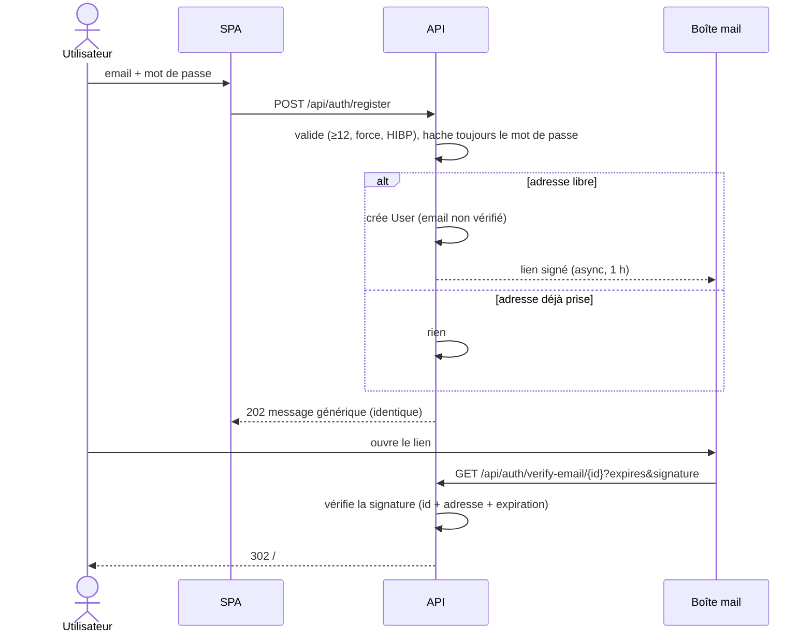

## Connexion email + mot de passe avec 2FA

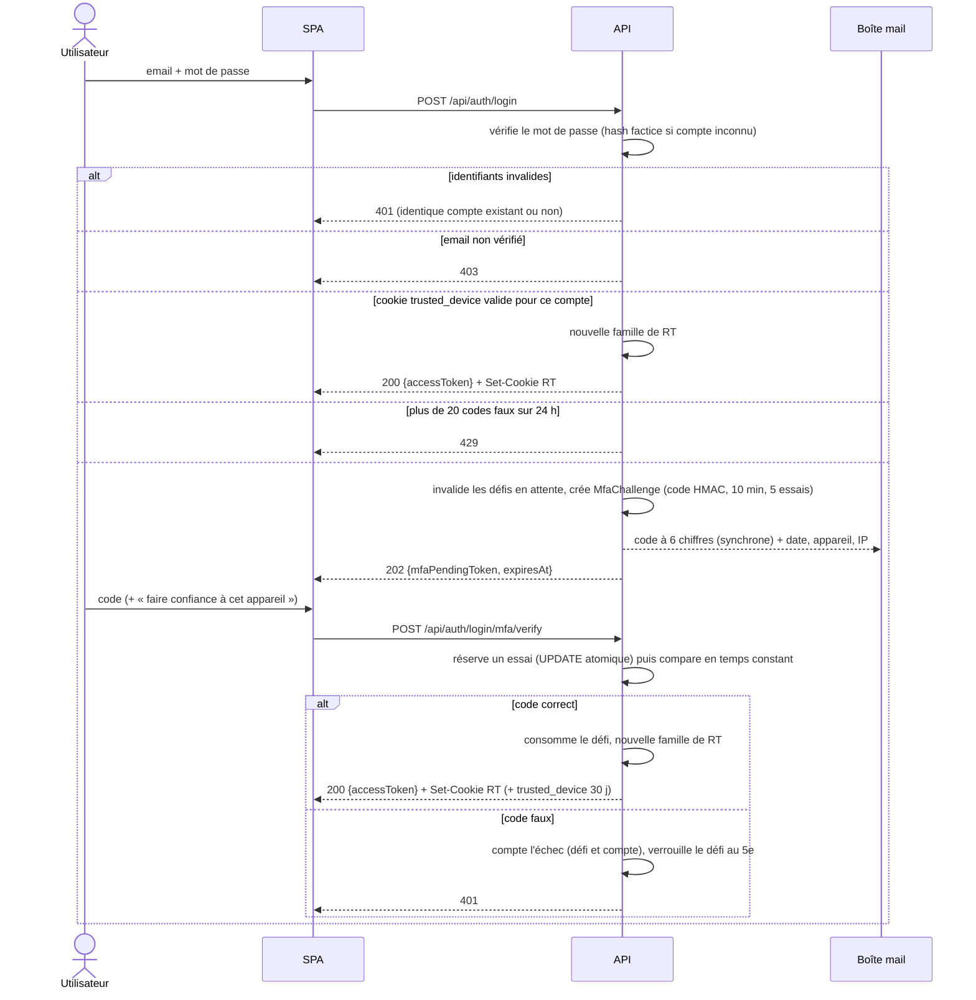

Renvoi du code : `POST /api/auth/login/mfa/resend` avec le `mfaPendingToken` ⇒ nouveau code, l'ancien
est invalide, 30 s minimum entre deux envois, jamais au-delà de 30 min après la connexion.

## Refresh, rotation et détection de rejeu

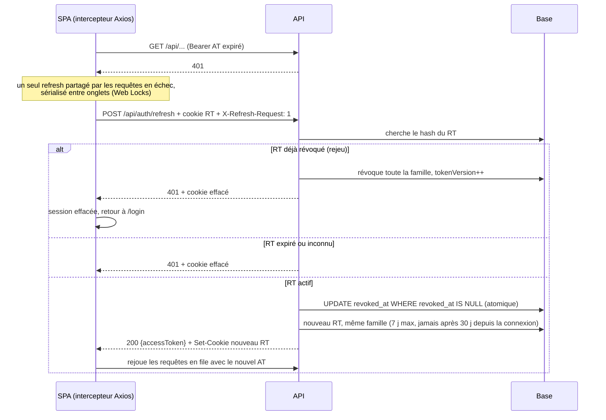

Au chargement de la page, le SPA n'a pas d'AT (mémoire seulement) : le guard appelle une fois
`auth.init()`, qui fait ce même refresh puis charge `/api/profile`.

## Déconnexion

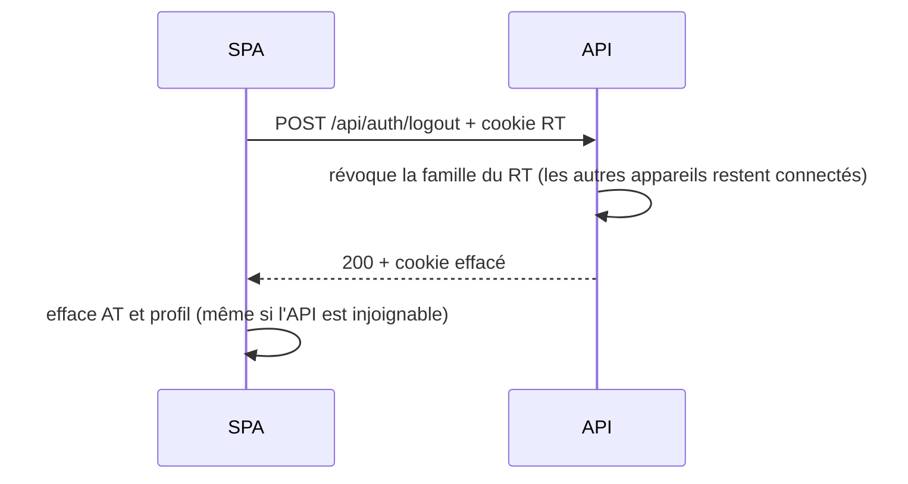

## Mot de passe oublié et réinitialisation

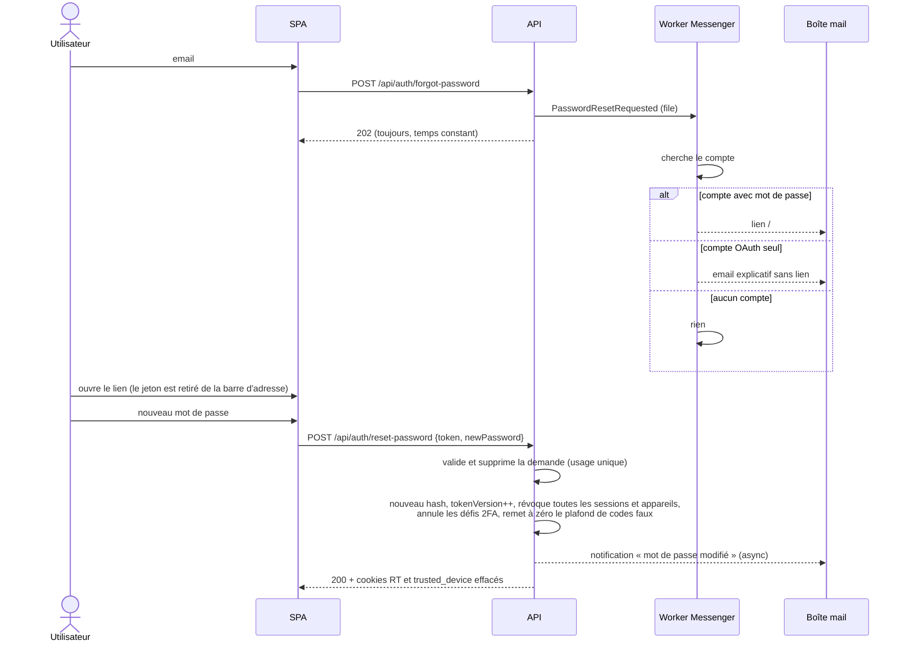

## Changement de mot de passe (profil)

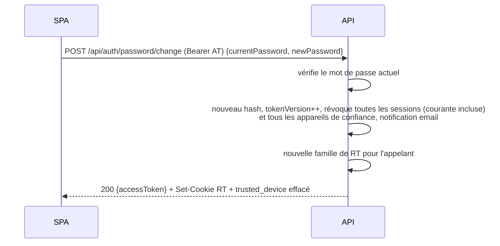

## Connexion OAuth (Google, Lichess)

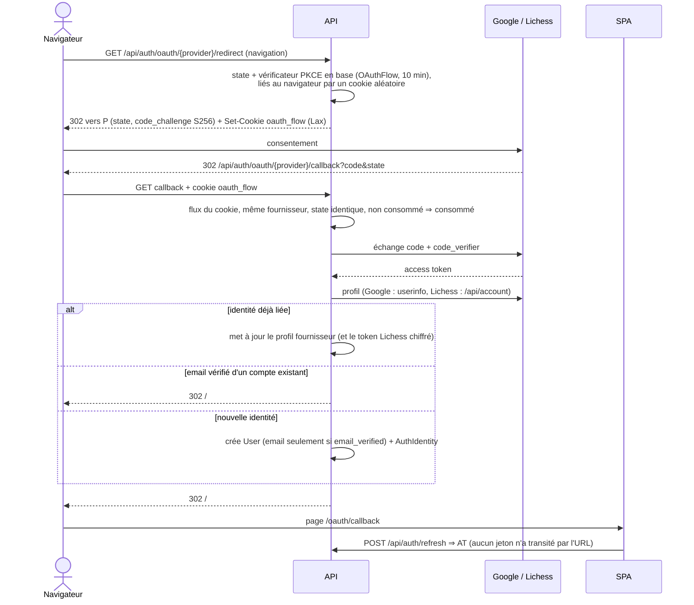

## Liaison d'un compte depuis le profil

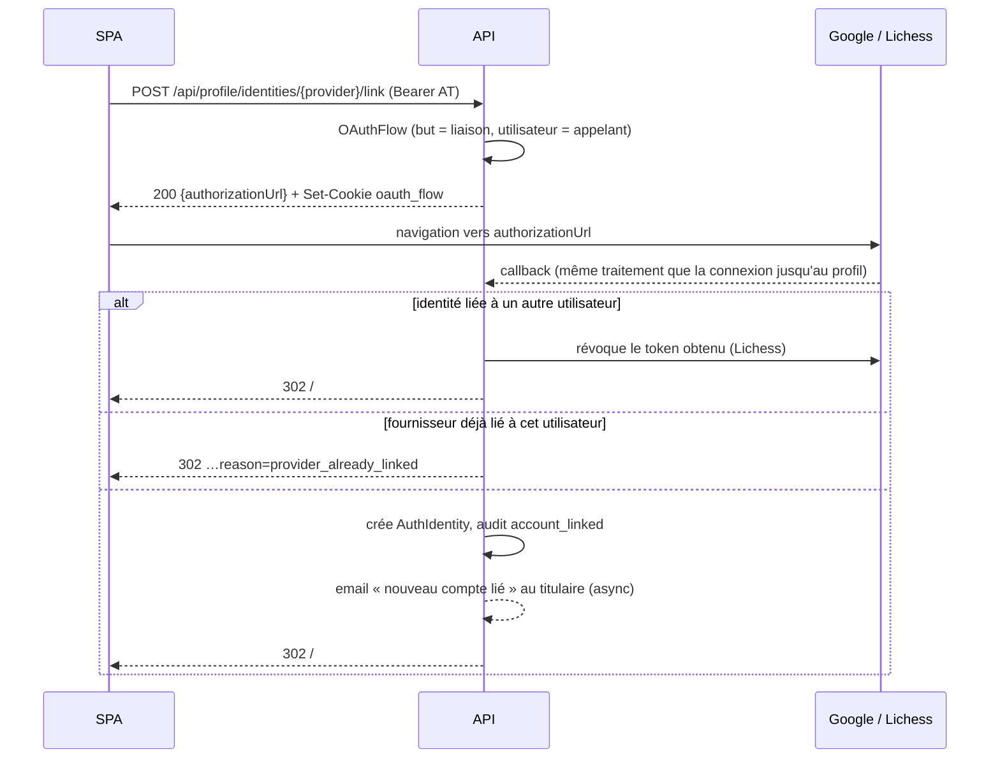

## Scope supplémentaire (`grant`, Lichess `study:read`)

La liaison Lichess ne demande aucun scope. Pour importer une étude privée ou non répertoriée, le SPA
demande `study:read` au compte déjà lié : flux `OAuthFlowPurpose::Grant`, même mécanique que la
liaison (state, PKCE, cookie `oauth_flow` lié au navigateur, usage unique), avec
`scope=study:read` dans l'URL d'autorisation.

- Le nouveau jeton n'est gardé que si Lichess renvoie **le même compte** que celui lié
  (`providerUserId`). Sinon il est révoqué et le callback répond `identity_mismatch` ; sans compte
  Lichess lié, `not_linked`.
- Gardé, il remplace l'ancien, qui est révoqué chez Lichess ; `AuthIdentity.metadata.scopes` note
  `study:read` (Lichess ne renvoie pas les scopes accordés) ; audit `oauth_scopes_granted`. Le profil
  expose ces `scopes`.
- Le jeton n'est utilisé pour les études que s'il porte ce scope ; le jeton applicatif ne l'est
  jamais. Une nouvelle connexion Lichess (jeton sans scope) efface la mention.
- Retour : `/#/oauth/callback?status=…&mode=grant` ; le SPA revient à la page d'import (chemin gardé
  en `sessionStorage`, limité à `/repertoire/import`).

## Ajout d'un mot de passe à un compte OAuth

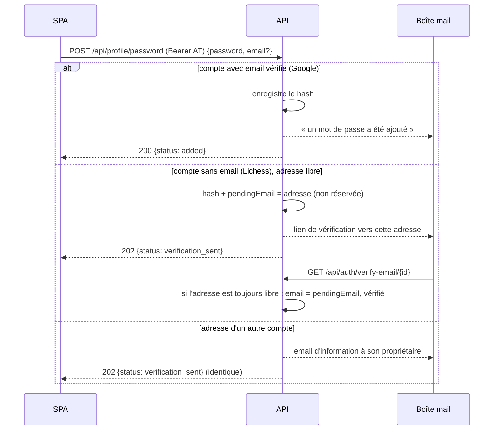

## Retrait d'une identité liée

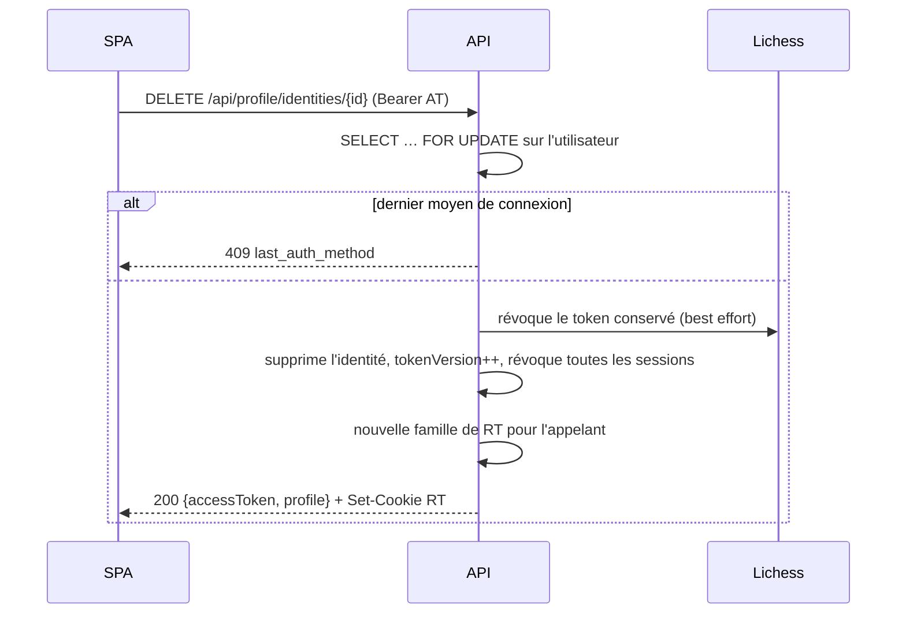

## Appareils de confiance

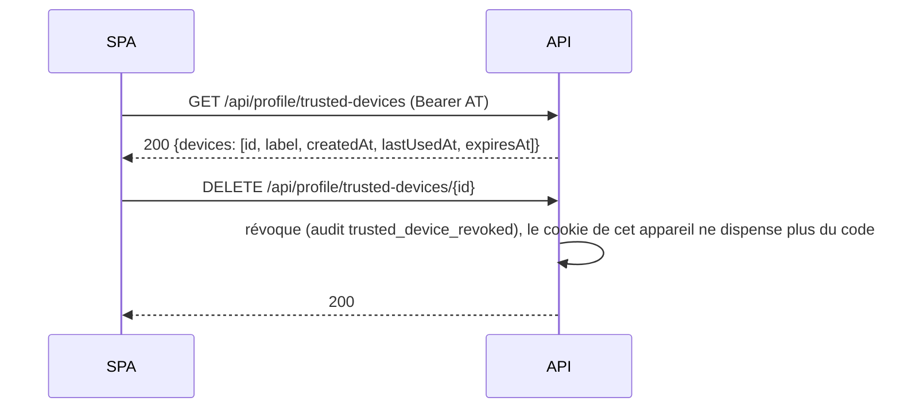

## Suppression du compte

Choix validés le 2026-10-05. La demande se confirme par une **preuve fraîche** : un code à
6 chiffres envoyé par email (HMAC avec le secret de l'application, 10 minutes, 5 essais, un code
par compte ; table `account_deletion_code`), ou, pour un compte **sans email vérifié** (Lichess
seul), une connexion de moins de 10 minutes (`signed_in_at` de la famille de RT de la session, d'où
les routes sous `/api/auth`, chemin du cookie RT). Une connexion plus ancienne demande de se
reconnecter.

Une fois confirmée (`App\Security\Account\AccountDeletion`) :

- `app_user.deletion_scheduled_at` = maintenant + 30 jours ; `tokenVersion` incrémenté et toutes les
  familles de RT révoquées : déconnecté partout. Email de confirmation (avec la date) ; journal
  `account_deletion_scheduled`.
- Le compte est **gelé** : la connexion reste possible, mais `FrozenAccountListener` répond 403
  `account_frozen` (avec `deletionScheduledAt`) à toute route hors `/api/auth/*`, le profil (`GET
  /api/profile`, thème, fuseau) et l'export des données. Pas de rappel de session, flux iCal en 404.
- Annuler (`/cancel`) rend le compte tel quel ; email et journal `account_deletion_cancelled`.

**Purge** (`App\Security\Account\AccountPurger`, cron quotidien `bin/console app:account:purge`,
idempotent) des comptes dont la date est passée, une transaction chacun : jetons OAuth conservés
révoqués chez le fournisseur (comme au retrait d'une identité), RT supprimés (clés par identifiant,
sans clé étrangère), lignes du journal d'audit gardées mais **détachées et anonymisées** (IP,
navigateur et détails effacés), puis suppression de `app_user` : toutes les tables du compte suivent
par `ON DELETE CASCADE`. Une ligne `account_deleted`, liée à personne et sans donnée personnelle, en
garde la trace.

Front : carte « Données » du profil (`DataCard`, `composables/profile/useDataExport.js`) ; dialogue
`AccountDeletionDialog` (ce qui sera effacé, case « Je comprends », puis le code reçu, ou la connexion
récente, ou « Me reconnecter ») ; page `/account-deletion` : juste après la confirmation (déconnecté,
date dans `?at=`), puis seule page d'un compte gelé reconnecté (le guard du routeur l'y ramène,
`FROZEN_PAGE`) avec « Annuler la suppression », « Exporter mes données » et « Me déconnecter ».

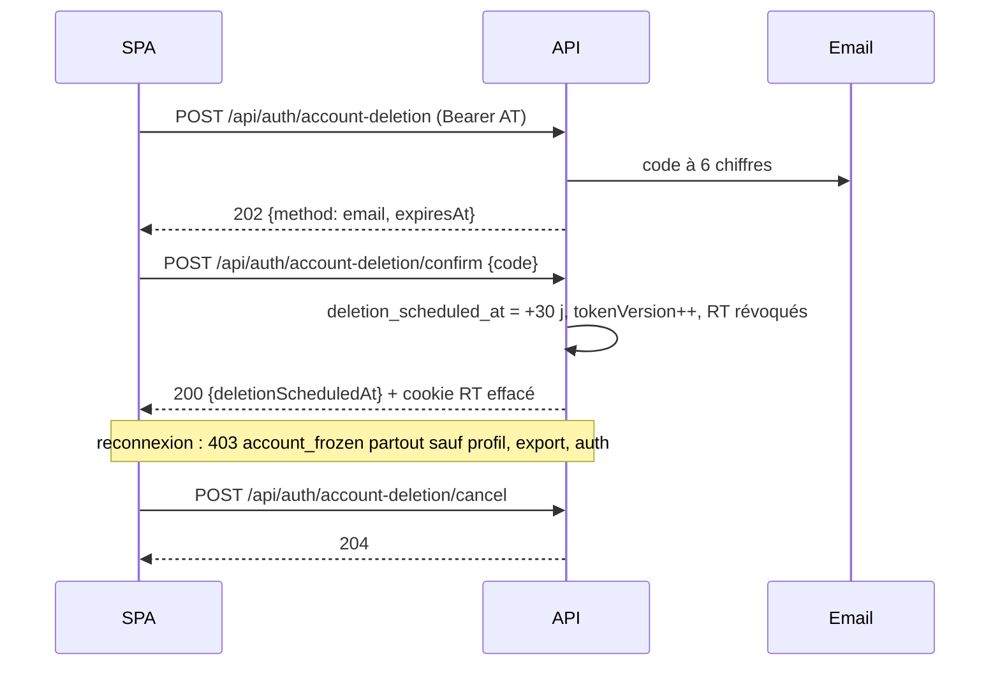

## Export des données

`GET /api/profile/export` (`App\Security\Account\DataExport`, choix validé : téléchargement direct)
construit à la demande un ZIP dans un fichier temporaire, envoyé puis supprimé (aucun fichier gardé sur
le serveur ; extension PHP `zip` requise) :

| Fichier | Contenu |
|---|---|
| `LISEZMOI.txt` | Description des fichiers |
| `profil.json` | Compte, préférences, comptes liés (fournisseur, identifiant, email du fournisseur), appareils de confiance (libellé, dates) |
| `puzzles.json` | Classement, historique du classement, tentatives (puzzle désigné par son identifiant Lichess) |
| `woodpecker.json` | Sets, puzzles des sets, cycles, tentatives, agrandissements |
| `repertoires.json` + `repertoires/NN-nom.pgn` | Répertoires, cartes FSRS, réponses, tests (présentations) ; chaque répertoire en PGN |
| `entrainement.json` | Séances chronométrées, sessions, sessions enregistrées |
| `activite.json` | Journal d'activité |

Colonnes choisies une à une : jamais d'empreinte de mot de passe, de jeton, d'empreinte de jeton ni de
secret chiffré (testé). Identifiants en UUID, instants en UTC (ISO 8601). Permis à un compte gelé (on
récupère ses données avant la purge) ; 3 exports par jour (`profile_export`) ; journal `data_exported`.

